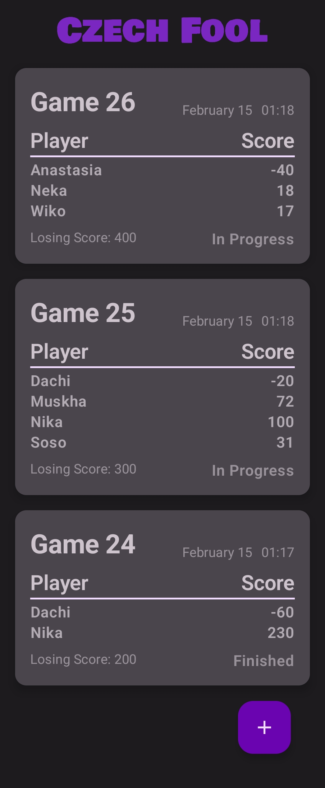
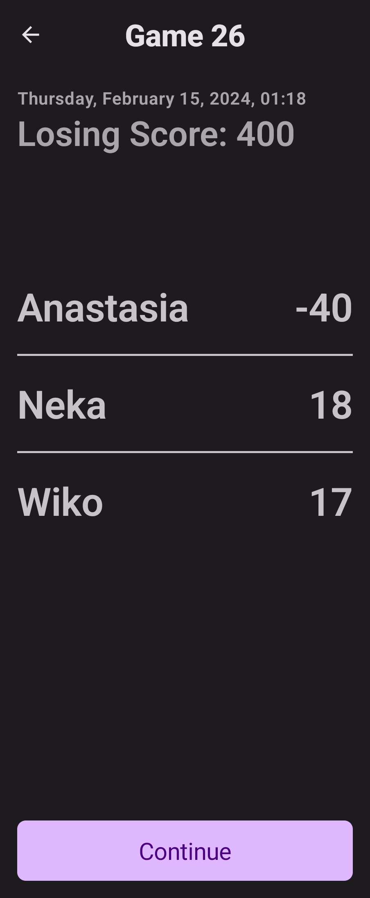
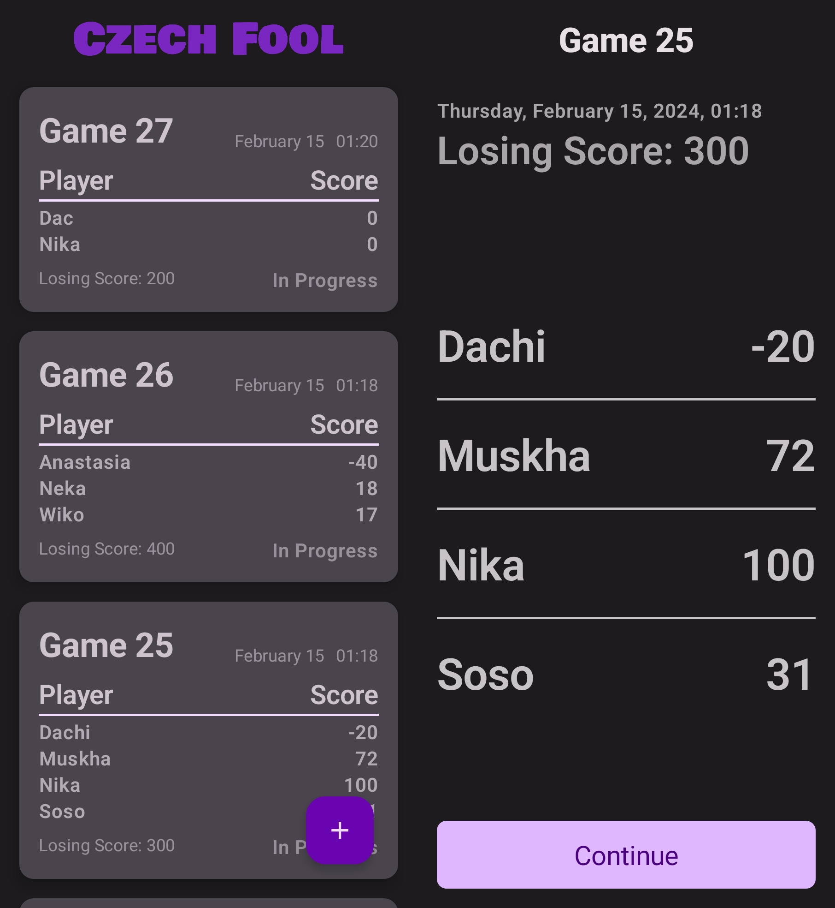
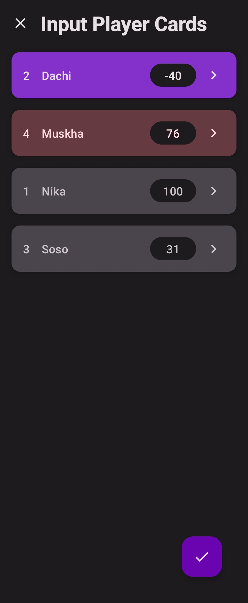
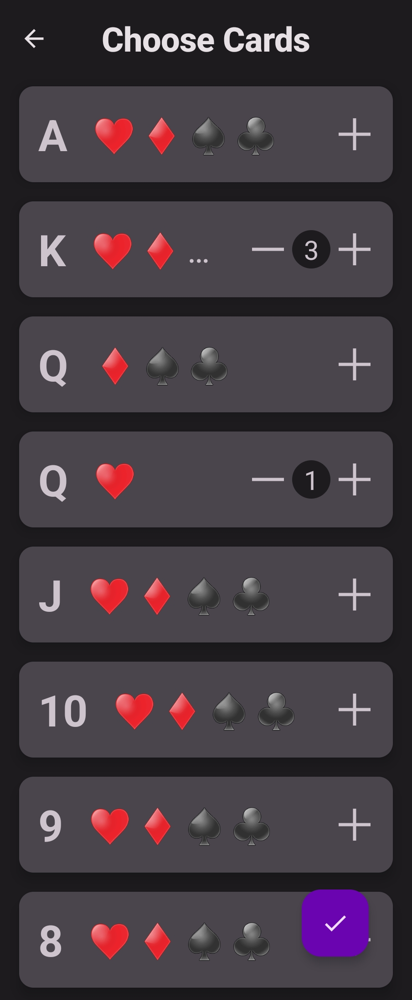
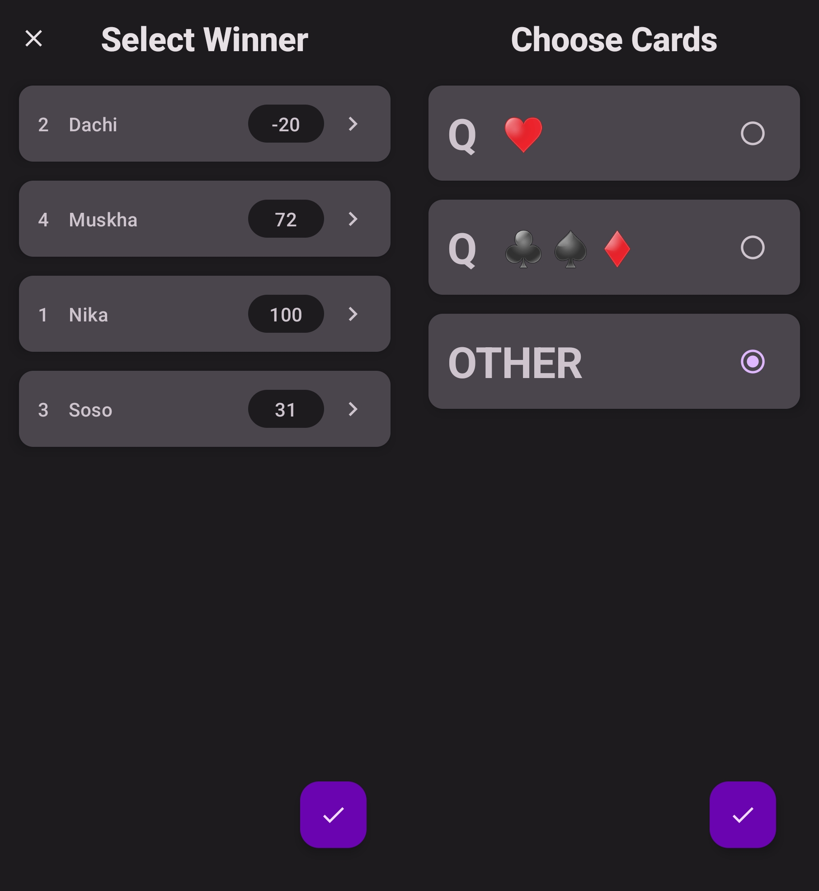
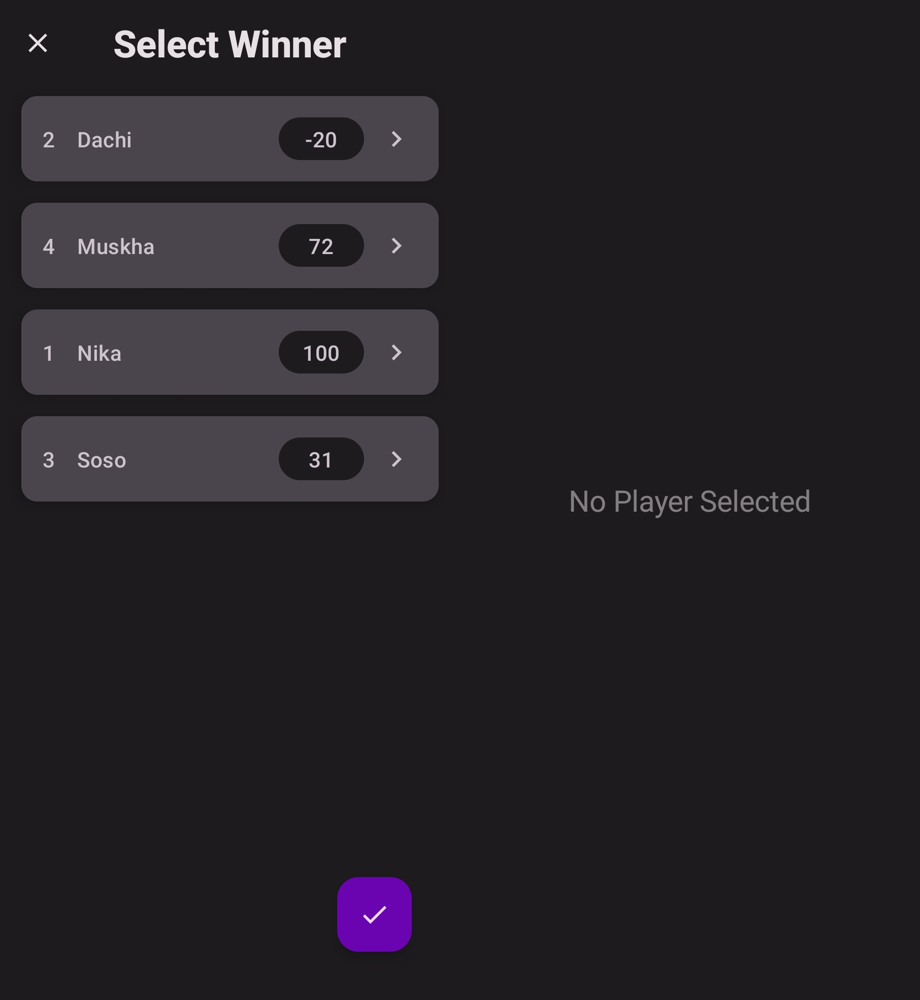

# Czech Fool

Czech Fool is an app used for tracking card game "Czech fool". This app was created for personal use and practice. Czech fool app is optimized for all types of devices, including both larger and smaller screens (foldables too). The app is fully process death safe. Moreover, Data layer is fully tested. 
Czech Fool app architecture closely follows [Guide to android app architecture](https://developer.android.com/topic/architecture).

### Technologies
- [Jetpack Compose](https://developer.android.com/jetpack/compose)
- [Room Library](https://developer.android.com/jetpack/androidx/releases/room)
- [Proto DataStore](https://developer.android.com/topic/libraries/architecture/datastore)

### Challenges Faced
- How to share data between ViewModels
- Should dynamically connected screens have one or multiple ViewModel
- How to join tables using Room library
- How to save state using SavedStateHandle
- How to implement CurrentGameManager
- How to stop compose from recomposing TextFields which didn't change
- Database normalization

## Features
This app contains four main routes: <u>Games History</u>, <u>Game Options</u>, <u>Name Input</u>, <u>Game</u>. Some routes have two screens, which are connected using dynamic navigation (for different screen sizes), while others have one screen.

#### App Scaffolding
Package [`com.example.czechfoolapp`](app/src/main/java/com/example/czechfoolapp/ui/routes/gameshistoryroute)
[`MainActivity.kt`](app/src/main/java/com/example/czechfoolapp/MainActivity.kt) is applications entry point.
[`Navigation.kt`](app/src/main/java/com/example/czechfoolapp/Navigation.kt) is responsible for navigation in the app.

## Screenshots And Brief Descriptions

#### Games History Route
Package [`com.example.czechfoolapp.ui.routes.gameshistoryroute`](app/src/main/java/com/example/czechfoolapp/ui/routes/gameshistoryroute)
<u>Games History Route</u> has two screens, <u>Game List Screen</u> and <u>Game Detail Screen</u>.
<u>Game List Screen</u> shows list of games, when a game is clicked <u>Game Detail Screen</u> is shown, which displays more information about the game (currently, almost the same information). <u>Game Detail Screen</u> has the continue button using which game can be continued (it's disabled when Game is finished).

  
  
  

#### Game Options Route
Package [`com.example.czechfoolapp.ui.routes.gameoptionsroute`](app/src/main/java/com/example/czechfoolapp/ui/routes/gameoptionsroute)
<u>Game Options Route</u> has one screen, where user inputs losing score and number of players.

  

#### Name Input Route
Package [`com.example.czechfoolapp.ui.routes.nameinputroute`](app/src/main/java/com/example/czechfoolapp/ui/routes/nameinputroute)
<u>Name Input Route</u> has one screen, where user inputs names of players.

  

#### Game Route
Package [`com.example.czechfoolapp.ui.routes.gameroute`](app/src/main/java/com/example/czechfoolapp/ui/routes/gameroute)
<u>Game Route</u> has two screens, <u>Game Progress Screen</u> and <u>Card Choice Screen</u>. 
<u>Game Progress Screen</u> shows players and their scores (different colors show that player is winner or player score has been set for current round).  When player is clicked <u>Card Choice State</u> is shown, if the player is winner, the card player won with should be inputted, else all cards are shown can be chosen. after at least one card was chosen and done was clicked, players color changes and score is added, after all player scores have been inputted and the done was clicked, round is over and it starts all over again until at least one player loses or game is canceled.

  
  
  
  

## Database
Package [`com.example.czechfoolapp.database`](app/src/main/java/com/example/czechfoolapp/database)
Database has two entities, [`GameEntity`](app/src/main/java/com/example/czechfoolapp/database/model/GameEntity.kt) and a weak entity [`PlayerEntity`](app/src/main/java/com/example/czechfoolapp/database/model/PlayerEntity.kt) dependent on [`GameEntity`](app/src/main/java/com/example/czechfoolapp/database/model/GameEntity.kt). [`GameWithPlayers`](app/src/main/java/com/example/czechfoolapp/database/model/GameWithPlayers.kt) represents natural join between [`GameEntity`](app/src/main/java/com/example/czechfoolapp/database/model/GameEntity.kt) and [`PlayerEntity`](app/src/main/java/com/example/czechfoolapp/database/model/PlayerEntity.kt) which is used for querying game table.

## Datastore
Package [`com.example.czechfoolapp.datastore`](app/src/main/java/com/example/czechfoolapp/datastore)
[`CurrentGameDataSource.kt`](app/src/main/java/com/example/czechfoolapp/datastore/CurrentGameDataSource.kt) is responsible for persisting current game data, which is defined using protocol buffer [`current_game_data.proto`](app/src/main/proto/current_game_data.proto). Currently, it only stores one field id, which is used for process death handling.

## Data
Package [`com.example.czechfoolapp.data`](app/src/main/java/com/example/czechfoolapp/data)
Data layer consists of model classes, which will be used in UI and repositories, which are responsible for communicating with data sources.
All repositories are defined as an interface and then default implementations are provided, which is useful for dependency injection and testing.
[`CurrentGameManager.kt`](app/src/main/java/com/example/czechfoolapp/data/repository/DefaultCurrentGameManager.kt) is responsible for storing current game (using datastore) and managing changes to current game. 

